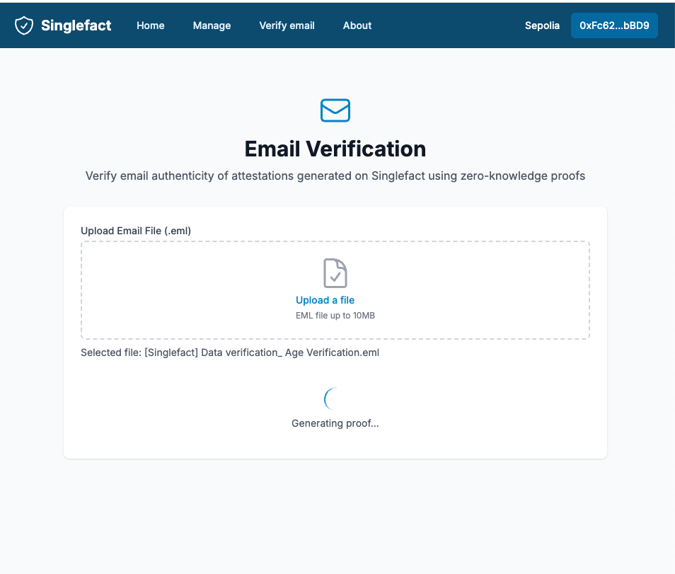

  

# Singlefact

A SaaS Platform for Privacy-Preserving Document Verification.

Built for Trifecta 2025.

Video demo:

Live Demo Url: https://singlefact.vercel.app (Sepolia)

## Inspiration

We wanted to revolutionize how personal information is verified while maintaining privacy. Common scenarios like:
- Proving minimum bank balance without revealing actual account details
- Verifying age/citizenship without exposing full passport information
- Confirming employment status without sharing sensitive payroll data
- Validating education credentials without revealing full transcripts

What Singlefact offers:

1. Privacy-Preserving Verification – Businesses & individuals need ways to prove attributes (income, identity, ownership) without revealing full documents.
2. Compliance & KYC Alternative – Financial institutions, HR, and Web3 platforms need privacy-preserving compliance solutions (e.g., proving accredited investor status without sharing bank statements).
3. Web3 & Identity Integration – Decentralized apps (dApps) want on-chain proofs for things like DAO memberships, token-gated access, or voting eligibility.
4. Enterprise Adoptability – Most companies don't want to manage zk-proof generation themselves (complex cryptography), making a plug-and-play API valuable.

These scenarios expose more personal data than necessary, creating security risks. We saw an opportunity to solve this with zero-knowledge proofs and blockchain technology.

More about zk proofs <a href="https://docs.succinct.xyz/docs/network/eli5" target="_blank">here</a>.

## What it does

Singlefact is a decentralized attestation platform that allows organizations to:

- Create and manage zero knowledge verifications without requiring ZK expertise.
- Define specific verification requirements without accessing raw data
- Track and verify attestations on-chain
- Integrate with an AI-powered interface for attestation verification

Users can:
- Submit private data for verification without exposing raw information
- Maintain control over their personal information
- Receive on-chain attestations of verified claims
- Present verified credentials without revealing source documents

## How it Works

### Proof Registration and Issuance
1. Organizations upload credential data (e.g., passports, bank statements, educational records).
2. Data is digitally signed by the issuing authority.
3. Document hashes and signatures are stored on-chain for verification (using Succinct).
4. Original documents remain secure and private.
5. Link to proof can be sent on the singlefact web app to the verifier. Verifier can log into and verify the validity of a statement with their connected wallet.
6. Verifier or recipient user can prove they received a document via email without revealing its contents (using zkEmail).

### Zero-Knowledge Proof Generation
Users can selectively prove facts like:
- Age verification from passport without revealing full document
- Account balance minimums without exposing actual amounts
- Educational achievement without sharing full transcripts
- Employment status without revealing salary details

Singlefact generates compact proofs that:
- Confirm specific facts exist within source documents
- Verify issuing authority signatures
- Validate document authenticity
- Maintain privacy of underlying data

## Business Model

- Usage-based pricing tied to number of attestations
- Example -
Free tier: 10 proofs/month.
$99/mo: 1,000 proofs.
$499/mo: Enterprise plan.

## Technologies used

Sepolia: A deployed smart contract Singlefact.sol manages the state of the app and the generated attestations.
Succinct:  Singlefact uses the EVM-compatible onchain verification with the Sepolia gateway to do the on chain proofs of the validated emails. The EVM-compatibility of Succinct made it possible for a contract to be able to manage both the full state of the app (and app methods such as generating and querying attestations) while not requiring a separate datasource for proofs and verification.

https://docs.succinct.xyz/docs/network/developers/request-proofs

ZkEmail: Authenticity of generated emails is important when working with personal information and validations. Singlefact uses a defined email template that can be regex'd by a custom registry.

Registry entry here: https://registry.zk.email/60b8c051-cbcc-4a70-a92d-ae55fb8cc1cf

## Potential future work

1. Use the MVP – A simple API + Web UI for zk-proof generation.
2. Talk to potential customers in fintech, HR, and Web3.
3. Offer trials and free use to gauge demand.

### Running the project

<pre>
cp .env.example .env
yarn
yarn dev
</pre>

### Doing a Singlefact production deployment

1. Update .env with production credentials
2. Deploy ZK verification circuits
3. Update attestation smart contracts on Base
5. Deploy web interface

### Useful links

* https://ethglobal.com/events/trifecta/prizes#zk-email

### Screenshots

#### Home Page

  

#### Upload Page

  

#### About Page

  

#### Manage Page

  

#### Verify Page

  

#### Email Text

  

#### Email Failed

  

#### Email Progress

  

